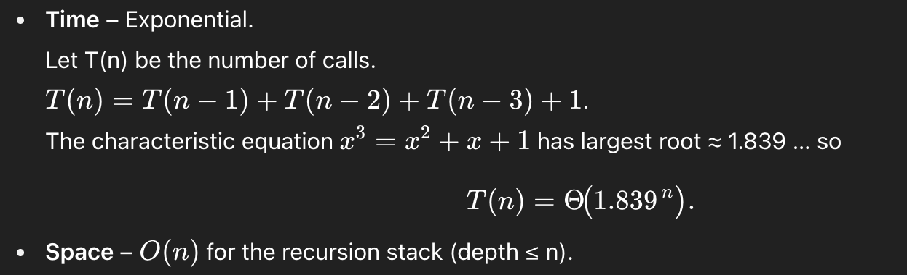

# 8.1 Triple Step

## The Question
A child is running up a staircase with n steps and can hop either 1 step, 2 steps, or 3
steps at a time. Implement a method to count how many possible ways the child can run up the
stairs.


## Questions I Will Ask Before Going into Solution
- What is the maximum and minimum number of steps in the staircase?
- Does changing the order or the number of steps make it a separate case?

## Simple Recursive Approach
```python
def solution(n):
    if n < 1:
        return 0
    elif n < 2:
        return 1
    elif n < 3:
        return 2
    else:
        return solution(n-3) + solution(n-2) + solution(n-1)
```

## Compelxity Analysis
The algorithm’s time complexity is exponential because it follows a third-order recurrence relation.
Spacial complexity will remain O(N).



## Memoization Approach
```python
 TBD
```

## Compelxity Analysis
TBD