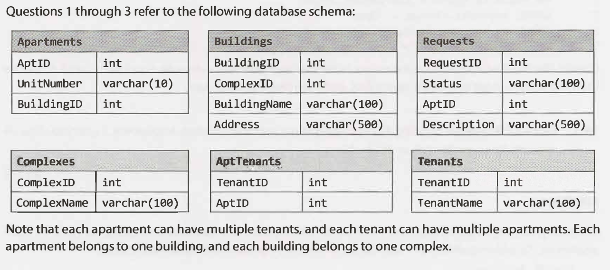

# 14.1: Multiple Apartments
Write a SQL query to get a list of tenants who are renting more than one apartment.


## solution
```sql
SELECT TenantName
FROM Tenants
INNER JOIN
(
  SELECT TenantID
  FROM AptTenants
  GROUP BY TenantID
  HAVING COUNT(*) > 1
) C
ON Tenants.TenantID = C.TenantID;

SELECT t.TenantName, COUNT(*)
FROM Tenants t
JOIN AptTenants a ON t.TenantID = a.TenantID
GROUP BY t.TenantID, t.TenantName
HAVING COUNT(*) > 1;
```
