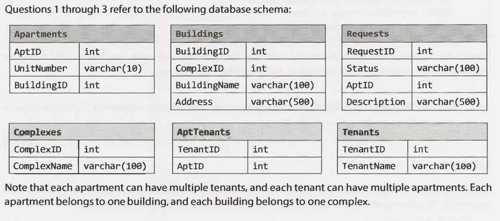

# 14.3 Close All Requests: 

## The Question
Building #11 is undergoing a major renovation. Implement a query to close all
requests from apartments in this building.


## Questions I Will Ask Before Going into Solution
- How entities are represented and what are their dependencies.

## Approach
일단 특정 조건을 부여한 상태에서의 모든 Request를 Close하라고 했으므로 Requests 테이블에 작업을 한다.
이 때 Request 인스턴스는 상태, 해당하는 아파트 ID를 가지는데, 아파트 ID가 11인 경우에만 상태를 'Closed'로 바꿔주는 것이 목적이다.

이미 데이터베이스에 해당 인스턴스들이 저장되어있는 상황을 가정하므로, 저장되어있는 Request 인스턴스들의
상태값을 조건부로 업데이트해주기 위해 UPDATE SET 명령어를 WHERE문과 함께 사용한다.


```sql
UPDATE Requests
SET Status = 'Closed'
WHERE AptID IN (SELECT AptID FROM Apartments WHERE BuildingID = 11)
```

