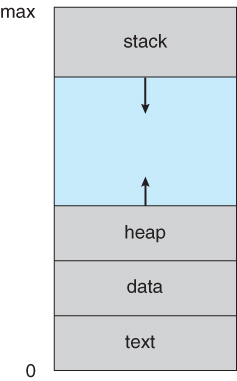
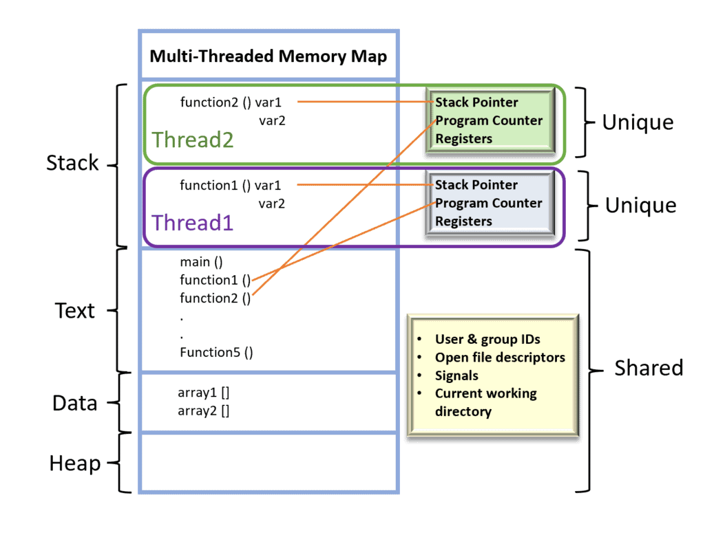
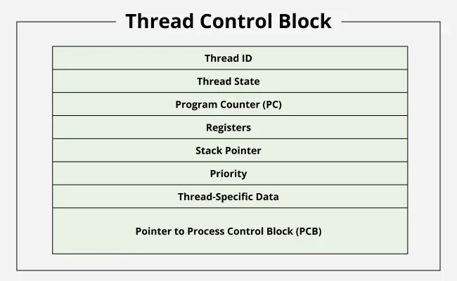
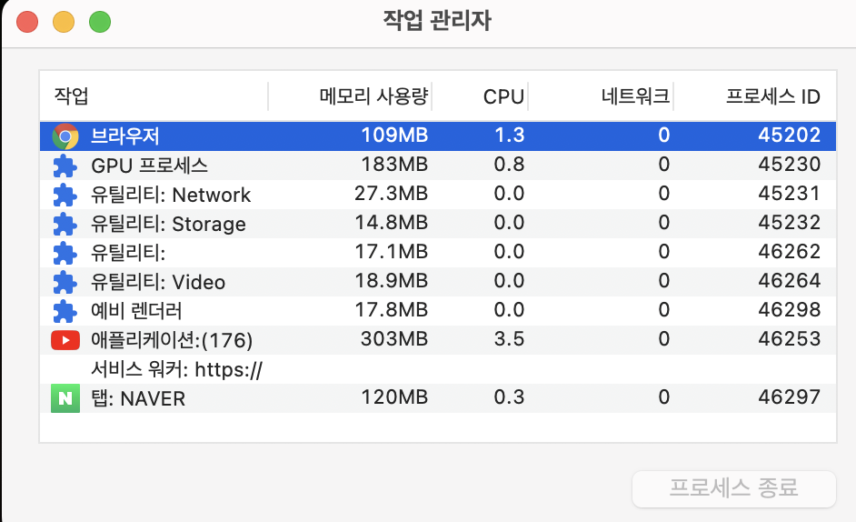
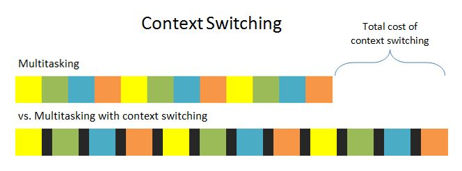

# 15.1 Thread vs Process: What's the difference between a thread and a process?

## Process

A process is an independent program in execution that has its own memory space, resources, and execution context. It's a running instance of a program as a separate entity in a Operating System.

Each processes have PCB(Process Control Block), and it has context information about a process. 

## Thread

A thread is a lightweight unit of execution within a process. It's the smallest sequence of programmed instructions that can be managed independently by the operating system.

Each threads have TCB(Thread Control Block), 

## Process VS Thread

### Memory

A process has independent its own memory space, but a thread don't. Each threads have stack memory as their own memory space, but they share other memory area.

### Weight and Context Switching

Process creation is expensive in terms of time and computation resources because the OS must allocate separate memory and initialize new process structures. But thread creation is much faster and requires fewer resources since threads share most resources with their parent process. Thread has much smaller context information than a process, so that's why thread is called light-weight process and much faster in context switching.

### Communication

Processes use IPC(Inter-Process Communication) like pipes, shared memory, message queues, or sockets to communicate with each other. But threads can communicate directly through shared memory since they share the same address space. So threads can communicate faster with other threads but requiring careful synchronization.

#### Independence and Fault Isolation

- Processes are independent - if one process crashes, it typically doesn't affect other processes.
- Threads are interdependent - if one thread crashes or corrupts shared memory, it can potentially bring down the entire process.

## Use Cases

### Stability

Web browsers use multi-processing for tabs because of stability. Let's assume that a single tab encounters a critical error. If the browser's tabs operated on multi-threading, it could cause the entire process to crash, so isolation between tabs wouldn't be ensured. When tabs work with multi-processing, a single tab's failure doesn't affect other tabs.

### Context Switching

Multi-threading doesn't always guarantee performance improvement. Threads have context switching costs after all. So even though their context switching cost is much cheaper than processes, what if switching happens too often? The performance could be worse. So creating and using the proper number of threads is really important in multi-threading.

### IO Bound & CPU Bound

CPU-bound means that tasks depend on CPU performance, while IO-bound means that tasks depend on IO performance. Examples of CPU-bound tasks can be image processing and data mining. And examples of IO-bound tasks can be network communication, database work, and file IO. As is well known, IO operations work much slower than the CPU, and since they're blocking operations, they take a really long time. So, in the case of IO operations, creating additional threads would be better for performance. But this still doesn't guarantee consistent performance improvement.